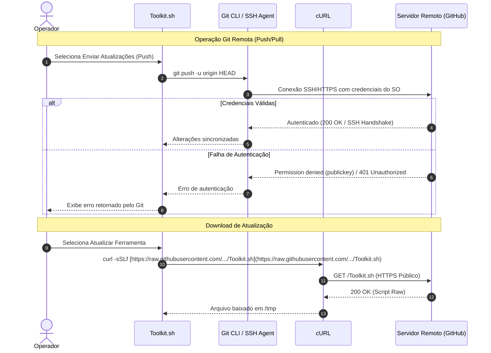

# API Specification: Project Toolkit

## Overview
O **Project Toolkit** é um utilitário cliente executado localmente via linha de comando e **não expõe serviços de API HTTP, REST, GraphQL ou gRPC**[cite: 1]. 

A comunicação externa do sistema ocorre exclusivamente por meio de chamadas de rede cliente disparadas pelos utilitários nativos `git` e `curl` contra servidores remotos (primariamente o GitHub)[cite: 1]:
- **Endpoint Upstream do Toolkit:** `https://raw.githubusercontent.com/PauloVNM/Project-Toolkit/main/Toolkit.sh` (Download via HTTPS)[cite: 1].
- **Protocolos de Transporte Utilizados:** HTTPS (porta 443) e SSH (porta 22) gerenciados diretamente pelas ferramentas do sistema operacional.

---

## Authentication
O script **não implementa sistema próprio de controle de acesso, login ou autenticação de usuários**[cite: 1]. 

A autenticação para operações remotas é completamente delegada aos mecanismos nativos do Git e do sistema operacional:
- **Operações Git (`git pull`, `git push`, `git clone`):** Utilizam chaves SSH (`~/.ssh/id_ed25519` ou `~/.ssh/id_rsa`) ou o gerenciador de credenciais do Git (`git-credential-store` / Personal Access Tokens via HTTPS).
- **Download de Atualizações (`curl`):** Acesso a endpoint público sem necessidade de cabeçalhos de autenticação (`Authorization`)[cite: 1].

---

### Diagram: Sequence (Delegação de Autenticação e Comunicação Externa)



---

## Endpoints (Admin & Public)
- **Status:** Não Aplicável (N/A).
- **Justificativa:** Por não atuar como um servidor web ou serviço de escuta de rede (*network listener*), o software não disponibiliza rotas administrativas ou rotas públicas[cite: 1]. A justificativa estrutural para a dispensa de controladores de rotas HTTP será documentada no artefato `decisions.md`.

---

## Errors
Os erros de comunicação e execução não utilizam códigos de status HTTP (como 4xx ou 5xx) ou payloads JSON de erro. Em vez disso, a ferramenta padroniza mensagens de diagnóstico formatadas no terminal via `stdout`/`stderr`[cite: 1]:

- **Falha de Rede / Download (`update_toolkit`):**
  - *Mensagem:* `Erro: Falha ao tentar conectar com o GitHub ou baixar a atualização. Verifique sua conexão de rede.`[cite: 1]
- **Repositório Ausente (`check_git_repo`):**
  - *Mensagem:* `Erro: Este diretório não tem um repositório Git.`[cite: 1]
- **Origem Remota Ausente (`pull_updates`):**
  - *Mensagem:* `Erro: Nenhum repositório remoto vinculado. Use a opção de vincular repositório primeiro.`[cite: 1]
- **Conflito de Mesclagem (`pull_updates`):**
  - *Mensagem:* `Aviso: Ocorreu um erro ao sincronizar. Isso geralmente acontece quando há conflitos de código...`[cite: 1]
- **Diretórios de Código Ausentes (`generate_code_context`):**
  - *Mensagem:* `Erro: Nenhum diretório 'src', 'source' ou 'public' encontrado.`[cite: 1]

---

## Examples
Exemplos de execução e uso da interface textual do Toolkit no terminal:

### 1. Inicialização do Utilitário
```bash
# Conceder permissão de execução (se necessário)
chmod +x Toolkit.sh

# Executar a ferramenta
./Toolkit.sh
```

### 2. Chamada Externa de Auto-Atualização Manual via Terminal
```bash
# Caso o operador queira baixar ou restaurar a ferramenta diretamente
curl -sSLf [https://raw.githubusercontent.com/PauloVNM/Project-Toolkit/main/Toolkit.sh](https://raw.githubusercontent.com/PauloVNM/Project-Toolkit/main/Toolkit.sh) -o Toolkit.sh && chmod +x Toolkit.sh
```