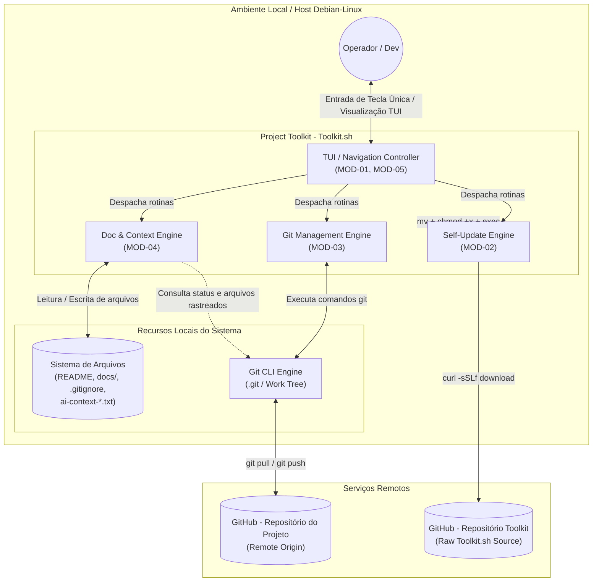
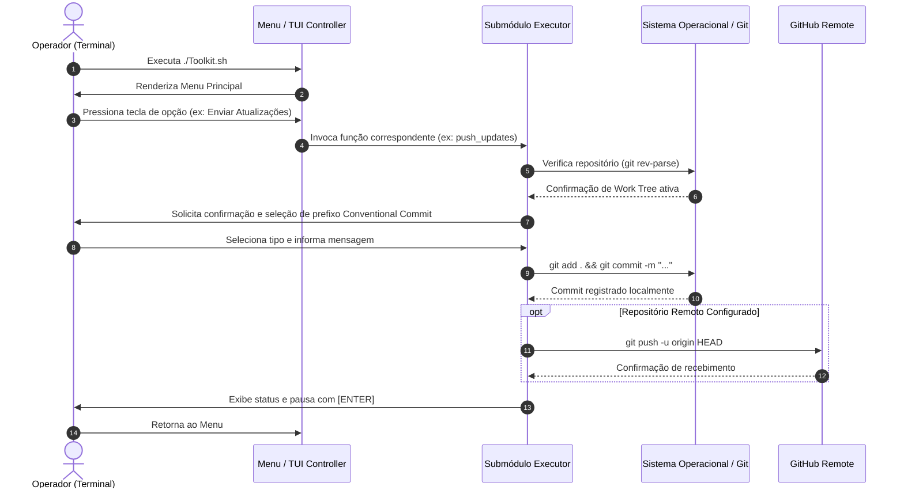

# Architecture: Project Toolkit

## Overview
O **Project Toolkit** adota uma arquitetura em script único (*single-file utility script*) estritamente procedural em **Bash**, projetada para execução local no ambiente de desenvolvimento do operador (Linux/Debian)[cite: 1]. 

A aplicação opera sem a necessidade de serviços em segundo plano (*daemons*), servidores web ou bancos de dados tradicionais. Seu funcionamento baseia-se na orquestração direta de binários nativos do sistema operacional (`git`, `curl`) e manipulação de arquivos no disco (`.gitignore`, arquivos `.md`, arquivos `.txt` de contexto)[cite: 1].

---

### Diagram: Component (Visão Macro dos Componentes)

---

### Diagram: Sequence (Fluxo Macro de Execução)

---

## Stack
- **Linguagem Principal:** GNU Bash (`#!/bin/bash`)[cite: 1] — script shell procedural estruturado em funções atômicas.
- **Ambiente de Execução:** Sistemas baseados em Linux/POSIX (primariamente Debian)[cite: 1].
- **Controle de Versão:** Git CLI (`git`)[cite: 1].
- **Transferência de Dados:** cURL (`curl`)[cite: 1] para recuperação de atualizações remotas via HTTPS.
- **Interface:** Terminal ANSI / VT100 com suporte a escape sequences (`clear`, `read -s -n 1`, `tput`/`echo` color/escapes)[cite: 1].

---

## Backend
O papel do "servidor" ou motor de execução no contexto do Project Toolkit é desempenhado pelo próprio **interpretador Bash**, que executa as seguintes responsabilidades:
- **Controle de Fluxo Procedural:** Roteamento de comandos por menus aninhados (`main_menu`, `git_menu`, `docs_menu`)[cite: 1].
- **Manipulação do Sistema de Arquivos:** Criação de diretórios, injeção idempotente de linhas em arquivos texto (`.gitignore`) e concatenação de múltiplos arquivos em buffers unificados (`ai-context-*.txt`)[cite: 1].
- **Subshell e Process Execution:** Invocação síncrona de comandos Git e controle de saída de erros (`2>/dev/null`, redirecionamento de streams)[cite: 1].
- **Substituição de Processo:** Utilização da chamada `exec "$0" "$@"` para trocar a imagem do processo em memória durante a auto-atualização sem manter processos zumbis ou buffers obsoletos em execução[cite: 1].

---

## Frontend
O "frontend" do sistema consiste em uma **Interface de Linha de Comando Textual (TUI)** orientada a menus interativos:
- **Design de Telas:** Telas desenhadas proceduralmente no stdout com cabeçalhos padronizados (`print_header`), linhas separadoras (`print_separator`) e limpeza de tela (`clear`)[cite: 1].
- **Captura Instantânea de Teclas:** Uso de `read -r -s -n 1` para permitir interação por tecla única sem necessidade de confirmação por [ENTER] para navegar nos menus[cite: 1].
- **Tratamento de Tecla Escape (`ESC`):** Interceptação de buffers residuais com leitura temporizada (`read -r -s -t 0.05 -n 2`) para distinguir o pressionamento isolado da tecla `ESC` de outras sequências de escape do terminal (como setas direcionais), garantindo um retorno limpo aos menus anteriores[cite: 1].

---

## Database
O Project Toolkit **não utiliza banco de dados relacional ou NoSQL**. Toda a camada de persistência e estado é baseada diretamente no sistema de arquivos local:
- **Estado de Versão:** Armazenado e controlado pela estrutura interna de objetos e refs do Git (`.git/`)[cite: 1].
- **Artefatos de Documentação:** Armazenados como arquivos estáticos `.md` na pasta `docs/` e `README.md` na raiz[cite: 1].
- **Configurações Locais de Usuário/Projeto:** Persistidas diretamente na configuração local do Git (`.git/config` via `git config --local`)[cite: 1].
- **Contextos Consolidados:** Persistidos em arquivos de texto temporários/auxiliares (`ai-context-docs.txt` e `ai-context-code.txt`)[cite: 1].

---

## Security
A estratégia de segurança do Toolkit foca no controle de execução local e prevenção contra vazamento acidental de dados:
- **Proteção contra Exposição Acidental (`BR-01`):** Injeção automática de exclusões no `.gitignore` (`# === Toolkit Protection ===`), impedindo que o próprio script, a metodologia ou os arquivos de contexto para IA sejam versionados e expostos em repositórios remotos[cite: 1].
- **Privilégios de Execução Mínimos:** O script executa sob o contexto de permissões do usuário do shell comum, sem exigir permissões de superusuário (`sudo`/`root`).
- **Segurança na Auto-Atualização (`FEAT-07`):**
  - O download utiliza HTTPS seguro contra a URL raw do repositório oficial no GitHub (`curl -sSLf`)[cite: 1].
  - **Trade-off / Risco Aceito:** O script baixa e substitui o arquivo executável diretamente da branch principal remota sem verificação criptográfica de integridade (como assinatura GPG ou hash SHA-256 fixo). Essa concessão de segurança simplifica o processo de atualização em ambiente local, conforme documentado para posterior registro em `decisions.md`[cite: 1].

---

## Infrastructure
- **Hospedagem / Distribuição:** Repositório público no GitHub (`PauloVNM/Project-Toolkit`)[cite: 1].
- **Ambiente de Destino:** Estações de desenvolvimento locais (Debian/Linux, sistemas POSIX compatíveis com Bash 4+)[cite: 1].
- **CI/CD:** Não aplicável no modelo atual; a distribuição da versão mais recente ocorre diretamente pela disponibilização do arquivo `Toolkit.sh` na branch `main` do GitHub[cite: 1].