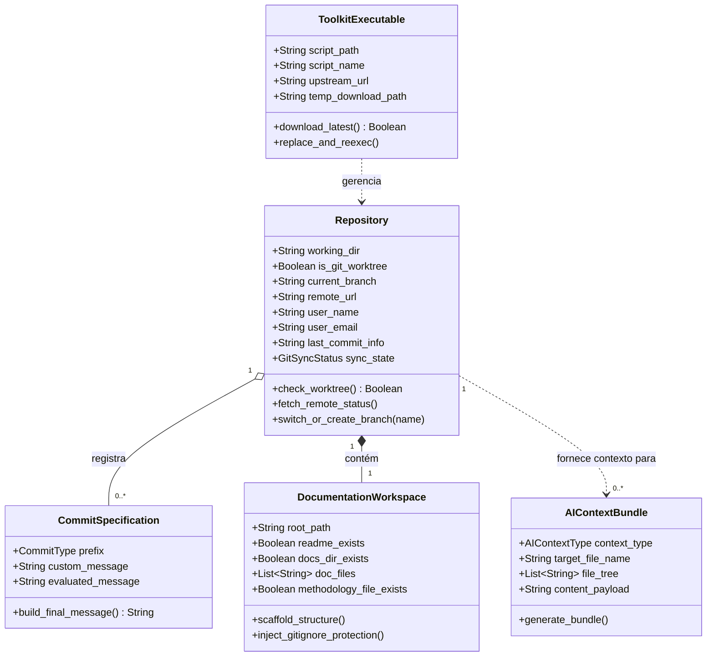
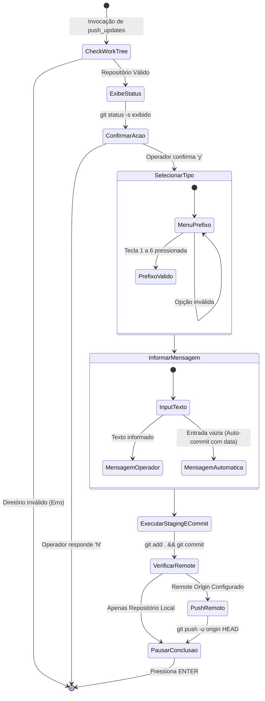

# Domain Model: Project Toolkit

## Entities

- **`Repository` (Repositório de Trabalho):** Representa a área de trabalho local sob controle de versão Git.
  - *Atributos:* `working_dir` (caminho local), `is_git_worktree` (booleano), `current_branch` (nome da branch ativa), `remote_url` (endereço do remote origin), `user_name` (autor configurado), `user_email` (e-mail configurado), `last_commit_info` (mensagem e tempo relativo), `sync_state` (`GitSyncStatus`)[cite: 1].
- **`CommitSpecification` (Especificação de Commit):** Representa a unidade semântica de alteração a ser persistida no histórico do Git.
  - *Atributos:* `prefix` (`CommitType`), `custom_message` (texto opcional do operador), `evaluated_message` (mensagem final resolvida), `staged_all` (booleano, padrão `true`)[cite: 1].
- **`DocumentationWorkspace` (Espaço de Documentação):** Representa a estrutura de arquivos padronizados de documentação dentro do projeto.
  - *Atributos:* `root_path` (caminho raiz), `readme_exists` (booleano), `docs_dir_exists` (booleano), `doc_files` (lista dos 10 arquivos `.md` obrigatórios), `methodology_file_exists` (booleano)[cite: 1].
- **`AIContextBundle` (Pacote de Contexto para IA):** Representa o arquivo de consolidação gerado para alimentar LLMs com informações do projeto.
  - *Atributos:* `context_type` (`AIContextType`), `target_file_name` (`ai-context-docs.txt` ou `ai-context-code.txt`), `file_tree` (lista de arquivos rastreados via `git ls-files`), `content_payload` (conteúdo consolidado dos arquivos elegíveis)[cite: 1].
- **`ToolkitExecutable` (Binário do Utilitário):** Representa o próprio script em execução e seus metadados de ciclo de vida.
  - *Atributos:* `script_path` (`$0`), `script_name` (nome base), `upstream_url` (URL raw do GitHub), `temp_download_path` (`/tmp/toolkit_update.sh`)[cite: 1].

---

### Diagram: Class (Entidades de Domínio)

---

## Relationships
- Um **`Repository`** encapsula um **`DocumentationWorkspace`** e pode receber múltiplos **`CommitSpecification`** ao longo do tempo[cite: 1].
- O **`AIContextBundle`** inspeciona os arquivos rastreados pelo **`Repository`** e o conteúdo do **`DocumentationWorkspace`** para consolidar artefatos de texto único[cite: 1].
- O **`ToolkitExecutable`** orquestra as operações sobre o **`Repository`**, gerencia o **`DocumentationWorkspace`** e é responsável por sua própria substituição atômica via download upstream[cite: 1].

---

## Enums

### `CommitType`
Prefixos semânticos padronizados suportados para criação de commits (`BR-03`)[cite: 1]:
- `feat:` — Novidades, novas funcionalidades e melhorias de escopo.
- `fix:` — Correção de falhas e bugs.
- `docs:` — Atualização de documentação, templates e metodologias.
- `refactor:` — Melhorias e reestruturações internas de código sem alteração comportamental.
- `perf:` — Melhorias diretas de performance e tempo de execução.
- `test:` — Adição ou ajuste de suítes de testes automatizados.

### `GitSyncStatus`
Estados calculados da sincronização entre o branch local e o upstream remoto (`RF-05`)[cite: 1]:
- `SYNCHRONIZED` — Branch local idêntica à remota (`ahead = 0`, `behind = 0`).
- `AHEAD` — Branch local contém commits não enviados ao servidor (`ahead > 0`, `behind = 0`).
- `BEHIND` — Servidor remoto contém commits não baixados para o local (`ahead = 0`, `behind > 0`).
- `DIVERGENT` — Histórico com ramificações divergentes (`ahead > 0`, `behind > 0`).
- `NO_UPSTREAM` — Nenhuma ramificação remota associada ou repositório remoto não configurado.
- `NOT_A_REPOSITORY` — O diretório de execução atual não é uma work tree Git válida.

### `AIContextType`
Tipos de extração de contexto de Inteligência Artificial (`RF-09`, `RF-10`)[cite: 1]:
- `DOCS` — Consolida a árvore de arquivos Git + `README.md` + `docs/*.md` em `ai-context-docs.txt`.
- `CODE` — Consolida a árvore de arquivos Git + `.gitignore` + código-fonte de `src/`, `source/` ou `public/` em `ai-context-code.txt`.

---

## Use-Cases

- **`UC-01` Iniciar Repositório Local (`RF-01`):** Valida se o diretório já possui Git; caso negativo, inicializa a work tree local com a branch padrão `main`[cite: 1].
- **`UC-02` Clonar Repositório Remoto (`RF-02`):** Bloqueia a execução se já estiver dentro de um repositório Git; caso contrário, recebe a URL remota e clona a árvore para uma nova pasta local[cite: 1].
- **`UC-03` Sincronizar Repositório Remoto / Pull (`RF-03`, `BR-05`):** Verifica se o repositório e o remoto existem; executa `git pull --no-rebase origin HEAD` e emite orientações amigáveis caso ocorram conflitos[cite: 1].
- **`UC-04` Criar e Enviar Commit Semântico (`RF-04`, `BR-03`, `BR-04`):** Solicita confirmação de indexação (`git add .`), apresenta menu interativo de seleção de `CommitType`, captura mensagem descritiva (ou aplica timestamp automático caso vazia), executa o commit e submete ao remote via `git push -u origin HEAD` se configurado[cite: 1].
- **`UC-05` Inspecionar e Configurar Estado Git (`RF-05`):** Exibe métricas de autor, branch ativa, URL remota e `GitSyncStatus`; permite alterar configurações locais de autor/e-mail, editar URL remota e listar, alternar ou criar branches via `git switch`[cite: 1].
- **`UC-06` Estruturar Espaço de Documentação (`RF-06`, `BR-01`):** Garante a criação idempotente de `README.md`, diretório `docs/` e os 10 arquivos `.md` estruturais, aplicando a proteção no `.gitignore`[cite: 1].
- **`UC-07` Injetar Proteção de Artefatos (`RF-07`, `BR-01`):** Adiciona o bloco `# === Toolkit Protection ===` ao `.gitignore` local para ignorar o script, metodologias e contextos consolidados[cite: 1].
- **`UC-08` Gerar Template de Metodologia (`RF-08`):** Cria o arquivo `development-method.md` na raiz do repositório contendo as regras e diagramas dos fluxos de Descoberta, Desenvolvimento Isolado e Auditoria[cite: 1].
- **`UC-09` Consolidar Contexto de Documentação (`RF-09`):** Gera o arquivo `ai-context-docs.txt` contendo a listagem de arquivos Git e o conteúdo de todos os arquivos Markdown de documentação[cite: 1].
- **`UC-10` Consolidar Contexto de Código-Fonte (`RF-10`):** Inspeciona diretórios `src/`, `source/` ou `public/`, filtra arquivos não ignorados via `git ls-files` e consolida a árvore, o `.gitignore` e o código-fonte em `ai-context-code.txt`[cite: 1].
- **`UC-11` Auto-Atualizar Utilitário (`RF-11`, `BR-06`):** Efetua o download do arquivo `Toolkit.sh` a partir do GitHub, substitui o executável corrente, aplica permissões de execução e reinicia o processo via `exec`[cite: 1].

---

### Diagram: Activity (Ciclo de Vida do Envio de Alterações - UC-04)

