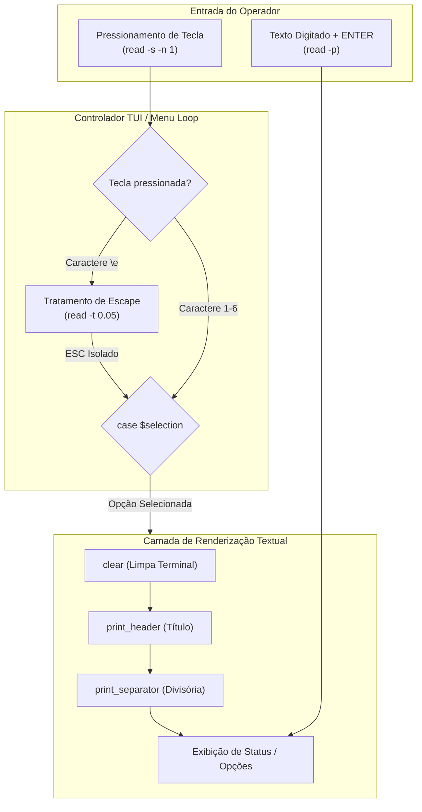

# Frontend Specification: Project Toolkit

## Structure
O **Project Toolkit** não adota um frontend Web tradicional (HTML, CSS, JavaScript) nem frameworks de interface gráfica (React, Vue, Electron ou Flutter)[cite: 1]. 

A camada de interface do usuário consiste em uma **Interface Textual de Terminal (TUI)** executada no próprio emulador de terminal do operador (stdout/stdin)[cite: 1]. Os elementos visuais são organizados proceduralmente em funções de desenho e renderização dentro de `Toolkit.sh`[cite: 1]:
- **Funções de Apresentação Visual:** `print_header()` e `print_separator()` para estruturação visual de blocos de conteúdo e títulos de tela[cite: 1].
- **Controladores de Tela / Menus:** `main_menu()`, `git_menu()`, `docs_menu()` e a tela de painel `manage_state()`[cite: 1].
- **Diálogos de Interação:** Prompts de captura de texto (`read -p`) e pausas controladas (`pause_prompt`)[cite: 1].

---

## Routing
A navegação visual no Toolkit substitui o roteamento baseado em URLs ou rotas de componentes por **laços de repetição contínuos (`while true`) e desvios condicionais (`case $selection in`)**[cite: 1]:

- **Transição de Telas:** Cada seleção de menu limpa o buffer da tela (`clear`) e renderiza a visão do submenu correspondente[cite: 1].
- **Navegação Não-Bloqueante:** A captura de entrada é realizada via `read -r -s -n 1` (leitura silenciosa de 1 caractere), eliminando a necessidade de pressionar [ENTER] para acionar opções numéricas[cite: 1].
- **Tratamento de Tecla de Retorno (`ESC`):** O sistema monitora a sequência ASCII `\e` com timeout curto (`read -r -s -t 0.05 -n 2`) para identificar o pressionamento isolado do `ESC` (retorno imediato ao menu anterior ou encerramento da aplicação) sem interpretar incorretamente setas do teclado[cite: 1].

---

## Components
A interface é composta por padrões visuais textuais padronizados implementados no próprio script[cite: 1]:

- **`HeaderBox` (`print_header`):** Executa a limpeza da tela (`clear`) e renderiza um cabeçalho delimitado por linhas duplas (`===`) com o título da seção centralizado[cite: 1].
- **`SeparatorLine` (`print_separator`):** Renderiza uma linha horizontal divisória (`----------------------------------------`) para separar blocos de dados ou status[cite: 1].
- **`ActionMenu` (Listas de Opções):** Lista textual numerada exibindo os comandos disponíveis com descrições curtas e intuitivas[cite: 1].
- **`StateDashboard` (`manage_state`):** Painel tabular com alinhamento textual que apresenta os dados consolidados do repositório (diretório, usuário, e-mail, branch, remote origin, status de sincronia e último commit)[cite: 1].
- **`PausePrompt` (`pause_prompt`):** Barra de pausa que orienta o operador a pressionar `[ENTER]` para retornar à navegação após o término de um comando[cite: 1].

---

## State Management
O gerenciamento de estado da interface ocorre inteiramente em **memória volátil do processo Bash**, utilizando variáveis locais (`local`) e argumentos de funções para evitar vazamento de escopo[cite: 1]:

- **Estado de Navegação:** Armazenado temporariamente na variável `selection` durante a avaliação de cada loop de menu[cite: 1].
- **Estado Dinâmico do Painel:** As variáveis `current_branch`, `remote_url`, `user_name`, `user_email`, `last_commit` e `sync_status` são calculadas sob demanda a cada iteração de renderização do painel em `manage_state()`[cite: 1].
- **Estado de Commit:** Armazenado temporariamente durante o fluxo de envio nas variáveis `selection`, `commit_prefix`, `commit_msg` e `final_msg`[cite: 1].

---

### Diagram: Data-Flow (Fluxo de Dados da Interface)

---

## Styling
- **Status:** Não Aplicável (N/A) para arquivos CSS/Sass/Tailwind.
- **Formatação Visual Adotada:** O design visual adota a estética minimalista padrão de terminais ANSI/POSIX, baseando-se em caracteres ASCII simples (`=`, `-`), quebras de linha controladas (`\n`) e espaçamento padronizado para garantir total legibilidade em qualquer emulador de terminal (VS Code Terminal, Kitty, Alacritty, GNOME Terminal)[cite: 1].

---

## API Integration
- **Status:** Não Aplicável (N/A) no formato HTTP/REST (Fetch API, Axios, SWR, React Query).
- **Justificativa:** A interface textual se comunica diretamente com os executáveis nativos do sistema operacional (`git`, `curl`) através de subshells do Bash, consumindo as saídas padrão e variáveis locais diretamente sem camadas de serialização JSON ou clientes HTTP de frontend[cite: 1]. A justificativa estrutural será registrada em `decisions.md`.