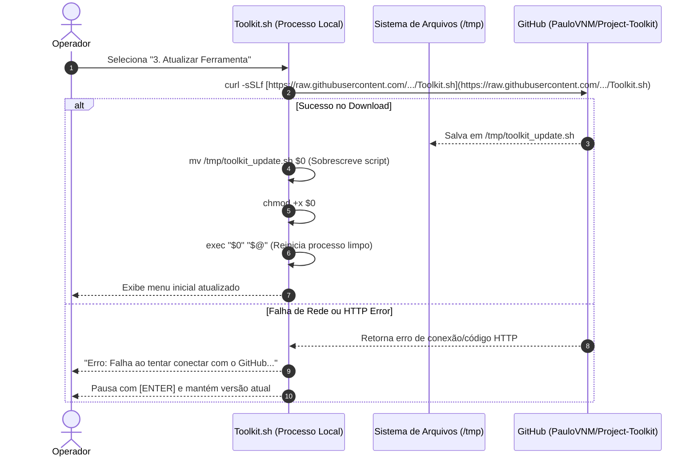

# Infrastructure: Project Toolkit

## Environment
O **Project Toolkit** é uma ferramenta utilitária cliente que executa diretamente na estação de trabalho local do desenvolvedor (*Bare Metal* ou máquina de desenvolvimento móvel sobre Debian/Linux)[cite: 1]. Não requer contêineres Docker, servidores dedicados, instâncias VPS ou serviços em nuvem para seu funcionamento[cite: 1].

---

## Hardware Specs
Os requisitos de recursos computacionais são mínimos e proporcionais a um utilitário de shell:
- **Processador (CPU):** Qualquer arquitetura compatível com Linux (x86_64, ARM) capaz de executar o interpretador Bash.
- **Memória (RAM):** Consumo insignificante (< 15 MB de memória de trabalho durante operações do Bash e Git).
- **Armazenamento (Disco):** Menos de 50 KB para o script `Toolkit.sh` e espaço em disco padrão dependente do tamanho do repositório Git local e dos arquivos de contexto gerados (`ai-context-*.txt`)[cite: 1].
- **Rede:** Conexão com a Internet necessária apenas para operações remotas de Git (`clone`, `pull`, `push`) e para a rotina de auto-atualização via GitHub (`curl`)[cite: 1].

---

## System Software
- **Sistema Operacional:** Linux (primariamente Debian/Ubuntu ou distribuições compatíveis com POSIX)[cite: 1].
- **Shell / Runtime:** GNU Bash versão 4.0 ou superior (com suporte a `mapfile`, expansões de arrays e leitura com timeout)[cite: 1].
- **Binários do Sistema Necessários:**
  - `git` (v2.x+): Motor de controle de versão[cite: 1].
  - `curl`: Utilitário de transferência HTTP/HTTPS para download de atualizações[cite: 1].
  - `coreutils` (`clear`, `basename`, `date`, `touch`, `mkdir`, `mv`, `chmod`, `rm`, `cat`, `grep`, `sleep`): Utilitários nativos do sistema operacional Linux[cite: 1].

---

## Pipeline

### Modelo de Distribuição e Entrega Contínua
O projeto não utiliza uma esteira tradicional de build/compilação ou runner de CI/CD (como GitHub Actions). A distribuição ocorre de forma direta (*raw source delivery*):
1. Alterações no script `Toolkit.sh` são commitadas e enviadas para a branch `main` do repositório GitHub `PauloVNM/Project-Toolkit`[cite: 1].
2. As estações locais consomem a versão mais recente diretamente da URL raw oficial através da funcionalidade embutida de auto-atualização (`FEAT-07`)[cite: 1].

---

### Diagram: Sequence (Fluxo de Auto-Atualização / Delivery)



---

## Environment Variables
O script não requer variáveis de ambiente customizadas, arquivos `.env` ou segredos em disco para sua execução. Ele consome diretamente as variáveis padrão fornecidas pelo shell e pelo Git:
- `$0`: Caminho do arquivo do script em execução (utilizado para auto-atualização e reinicialização via `exec`)[cite: 1].
- `$@`: Argumentos posicionais passados na chamada do script[cite: 1].
- `$PWD`: Diretório de trabalho atual do terminal[cite: 1].
- `HOME`: Diretório do usuário para resoluções de caminho globais.

---

## Logs and Monitoring
- **Visualização Operacional:** As mensagens de status, alertas e resultados de comandos são exibidos diretamente na saída padrão (`stdout`) e formatados pela TUI com cabeçalhos e separadores textuais[cite: 1].
- **Tratamento de Saída de Erro (`stderr`):** Comandos de verificação não destrutivos (como `git rev-parse`, `git log`, `git fetch`) redirecionam erros para `/dev/null` (`2>/dev/null`) para evitar poluição visual na interface[cite: 1].
- **Monitoramento de Estado:** A visualização de sincronia Git (`FEAT-03`) faz inspeção ativa através de `git rev-list --count @{u}..HEAD` para determinar o número exato de commits adiantados ou atrasados[cite: 1].

---

## Rollback
Caso ocorra uma falha durante ou após a atualização do script:
1. **Falha no Download:** Se o `curl` falhar (erro de conexão ou URL indisponível), o arquivo local original `$0` permanece intacto e o processo não é reiniciado[cite: 1].
2. **Atualização Corrompida (Rollback Manual):** Se o script baixado apresentar inconsistências, o operador pode restaurar a versão funcional executando manualmente o download da versão anterior ou clonando o repositório novamente:
   ```bash
   curl -sSLf [https://raw.githubusercontent.com/PauloVNM/Project-Toolkit/main/Toolkit.sh](https://raw.githubusercontent.com/PauloVNM/Project-Toolkit/main/Toolkit.sh) -o Toolkit.sh && chmod +x Toolkit.sh
   ```