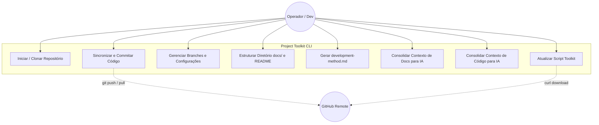
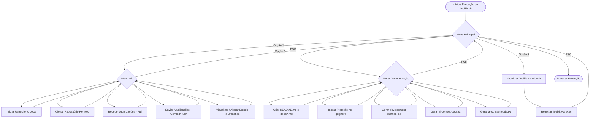

# Product: Project Toolkit

## Vision
O **Project Toolkit** é uma ferramenta de linha de comando (CLI) baseada em Bash, desenvolvida para simplificar, acelerar e padronizar rotinas essenciais do fluxo de trabalho de desenvolvimento de software. A ferramenta atua como facilitador operacional, centralizando o gerenciamento simplificado do Git, a inicialização da arquitetura de documentação do projeto e a consolidação automatizada de contexto documental e técnico para consumo por Modelos de Linguagem (LLMs/IAs).

## Scope

### O que o sistema faz (In-Scope / MVP)
- **Gerenciamento Git Guiado:** Inicialização de repositórios locais na branch `main`, clonagem de projetos, recebimento seguro de atualizações (`pull --no-rebase`), envio de alterações com padronização de Conventional Commits (`feat:`, `fix:`, `docs:`, etc.) e gerenciamento rápido de estado (usuário, e-mail, URL remota e branches).
- **Estruturação Documental Padronizada:** Criação automática do `README.md`, do diretório `docs/` e dos 10 arquivos estruturais de documentação (`product.md`, `architecture.md`, `domain.md`, `database.md`, `backend.md`, `api.md`, `frontend.md`, `decisions.md`, `features.md`, `infrastructure.md`).
- **Geração de Metodologia Operacional:** Criação do arquivo `development-method.md`, contendo os diagramas e regras operacionais dos fluxos de Descoberta, Desenvolvimento Isolado e Auditoria.
- **Proteção de Artefatos Locais:** Injeção automática de regras no `.gitignore` para impedir o versionamento acidental do script, da metodologia e dos arquivos de contexto consolidados.
- **Consolidação de Contexto para IA:**
  - Extração e consolidação da árvore de arquivos e de toda a documentação no artefato `ai-context-docs.txt`.
  - Extração e consolidação da árvore de arquivos e do código-fonte (diretórios `src`, `source`, `public`) no artefato `ai-context-code.txt`.
- **Auto-Atualização:** Atualização automática do script a partir do repositório remoto oficial no GitHub com reinicialização limpa do processo via `exec`.

### O que o sistema NÃO faz (Out-of-Scope)
- Não possui interface gráfica (GUI) Web ou Desktop; opera exclusivamente no terminal via texto/TUI interativa.
- Não atua como servidor ou serviço contínuo (daemon/background process).
- Não implementa camada de banco de dados, persistência em disco externa ou chamadas de API próprias.
- Não substitui o cliente Git nativo para resolução avançada de conflitos (rebase interativo, cherry-pick complexo, resolução manual de merges).
- Não gerencia múltiplos repositórios simultaneamente.

## Actors
- **`ACT-01` Desenvolvedor / Operador:** Usuário do terminal local que executa o script para gerenciar o repositório, estruturar a documentação e extrair contextos para IA.
- **`ACT-02` Repositório GitHub (Remote):** Servidor remoto que hospeda o código do projeto em desenvolvimento e fornece a versão mais recente do próprio Toolkit para auto-atualização.

## Glossary
- **Toolkit:** Script Bash utilitário (`Toolkit.sh`) executável localmente.
- **AI Context:** Arquivo consolidado (`.txt`) que une a estrutura de diretórios e o conteúdo de múltiplos arquivos para servir de entrada única para IAs.
- **Conventional Commits:** Padrão estruturado de prefixação de mensagens de commit (`feat:`, `fix:`, `docs:`, `refactor:`, `perf:`, `test:`).
- **Toolkit Protection:** Bloco de exclusão configurado no `.gitignore` para blindar artefatos operacionais.
- **Tri-Chat / Orquestração:** Metodologia de desenvolvimento assistido por IA que separa papéis em chats de Conversação, Impacto e Execução.

## Business Rules

- **`BR-01` Proteção Obrigatória de Artefatos:** Todo repositório que utilizar a ferramenta deve conter no `.gitignore` a regra `# === Toolkit Protection ===` impedindo o commit do script, da metodologia e dos arquivos `ai-context-*.txt`.
- **`BR-02` Validação de Ambiente Git:** Nenhuma operação de sincronização, commit ou extração de contexto pode ser executada fora de uma work tree válida do Git, com exceção de `init_repository` e `clone_repository`.
- **`BR-03` Obrigatoriedade de Prefixo Semântico:** Todo commit submetido via Toolkit deve selecionar compulsoriamente um prefixo semântico padronizado.
- **`BR-04` Mensagem Padrão de Commit:** Caso o operador não informe uma mensagem personalizada para o commit, o sistema deve registrar automaticamente `Auto-commit: YYYY-MM-DD HH:MM:SS`.
- **`BR-05` Estratégia de Pull Seguro:** A sincronização remota deve forçar a estratégia de mesclagem (`--no-rebase`) para mitigar conflitos de histórico divergente em rotinas simplificadas.
- **`BR-06` Auto-Substituição Contínua:** A rotina de atualização deve substituir o arquivo físico do script e reiniciar o processo imediatamente com os mesmos argumentos de entrada.

## Requirements

### Requisitos Funcionais
- **`RF-01` Inicialização de Repositório:** O sistema deve permitir inicializar um repositório Git local configurado com a branch primária `main`.
- **`RF-02` Clonagem de Repositório:** O sistema deve permitir clonar repositórios remotos a partir de uma URL informada pelo operador, bloqueando a execução se o terminal já estiver dentro de um repositório.
- **`RF-03` Recebimento de Atualizações (Pull):** O sistema deve buscar e integrar alterações do branch remoto correspondente via `git pull --no-rebase origin HEAD`.
- **`RF-04` Envio de Atualizações (Push):** O sistema deve permitir staging de todas as alterações (`git add .`), seleção de tipo semântico, entrada de mensagem e push para a origem remota.
- **`RF-05` Gerenciamento de Estado Git:** O sistema deve exibir a branch ativa, URL remota, autor, e-mail, último commit e status de sincronia (adiantado/atrasado), permitindo alterar configurações locais (`user.name`, `user.email`, `remote origin`) e criar/trocar de branches.
- **`RF-06` Inicialização de Documentação:** O sistema deve verificar e criar o arquivo `README.md`, a pasta `docs/` e os 10 arquivos `.md` estruturais, garantindo a proteção no `.gitignore`.
- **`RF-07` Injeção do .gitignore:** O sistema deve criar ou atualizar o arquivo `.gitignore` com o bloco de proteção do Toolkit sem sobrescrever regras existentes.
- **`RF-08` Geração de Metodologia:** O sistema deve gerar o arquivo `development-method.md` na raiz do projeto contendo as regras e diagramas do fluxo de desenvolvimento.
- **`RF-09` Geração de Contexto de Documentação para IA:** O sistema deve listar a árvore de arquivos rastreados e consolidar o conteúdo do `README.md` e de todos os arquivos em `docs/*.md` no arquivo `ai-context-docs.txt`.
- **`RF-10` Geração de Contexto de Código para IA:** O sistema deve listar a árvore do projeto e consolidar arquivos contidos em `src/`, `source/` ou `public/`, incluindo o `.gitignore`, no arquivo `ai-context-code.txt`.
- **`RF-11` Atualização Autônoma:** O sistema deve baixar a versão mais recente do Toolkit via GitHub e substituir o processo corrente.

### Requisitos Não Funcionais
- **`RNF-01` Portabilidade e Ambiente:** O sistema deve ser um script Bash executável nativamente em sistemas Linux/Unix (com foco em Debian) sem necessidade de interpretadores pesados externos (Node.js, Python, etc.).
- **`RNF-02` Dependências Mínimas:** O sistema deve depender exclusivamente de ferramentas nativas ou amplamente disponíveis (`bash`, `git`, `curl`).
- **`RNF-03` Interface de Tecla Única:** A navegação por menus e seleção de opções deve ser instantânea, utilizando leitura direta de caractere único (`read -s -n 1`).
- **`RNF-04` Resiliência de Navegação:** O sistema deve tratar sequências de escape do teclado (ex: tecla `ESC`) para permitir retorno suave de menus sem encerramento abrupto do script.

---

### Diagram: Use-Case

---

### Diagram: Flowchart (Jornada do Operador)

